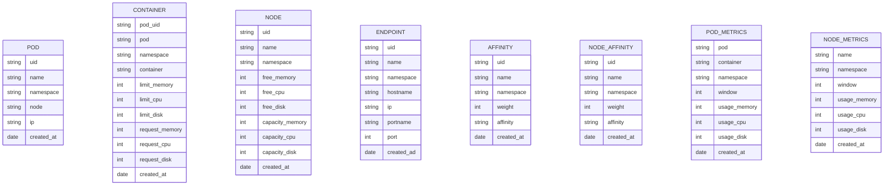

## ClusterSQL

Welcome to the ClusterSQL project! This project aims to provide a convenient way
to access Kubernetes objects through a MySQL interface. The controller
continuously watches for changes to Kubernetes objects and syncs them with
in-memory MySQL, allowing users to use familiar SQL commands to interact with
their Kubernetes clusters. Whether you are a MySQL expert looking for an easy
way to slice and dice your Kubernetes resources, or just want a new way to
visualize with your cluster, this project has something to offer.

This project was possible thanks to
[go-mysql-server](https://github.com/dolthub/go-mysql-server) project.

### Scope of this project

* Be a convenient SQL-based component on observability stacks to slice and dice
  cluster informations
* Provide access to the most common objects (Pods, Containers, Nodes, Metrics,
  Affinites)

Non-goals:
* Support all K8s objects
* Edit K8s cluster through SQL

## Build

```bash
docker build -t <image> -f ./build/Dockerfile .
```

## Deployment

```bash
kubectl apply -f ./deployments
```

## Limitations

ClusterSQL is a read-only interface. Any write query will not change the state
of the monitored cluster, though the in-memory tables will be rewritten
(TO-FIX).

The SQL limitations are listed in [here](https://github.com/dolthub/go-mysql-server)

## Data Model 

**TODO: Add complete diagram**

Tables:
* container
* endpoint
* pod
* affinity
* pod_metrics
* node
* node_affinity
* node_metrics



## Usage

Install mariadb-shell:

```bash
[fedora] $ sudo dnf install mariadb-shell
```

Expose port:

```bash
kubectl -n kube-system svc/clustersql 3306:3306
```

Connect and play:

```
mysql --host=0.0.0.0 --port=3306 --user=root kubernetes --execute="SELECT * FROM pods";
```
